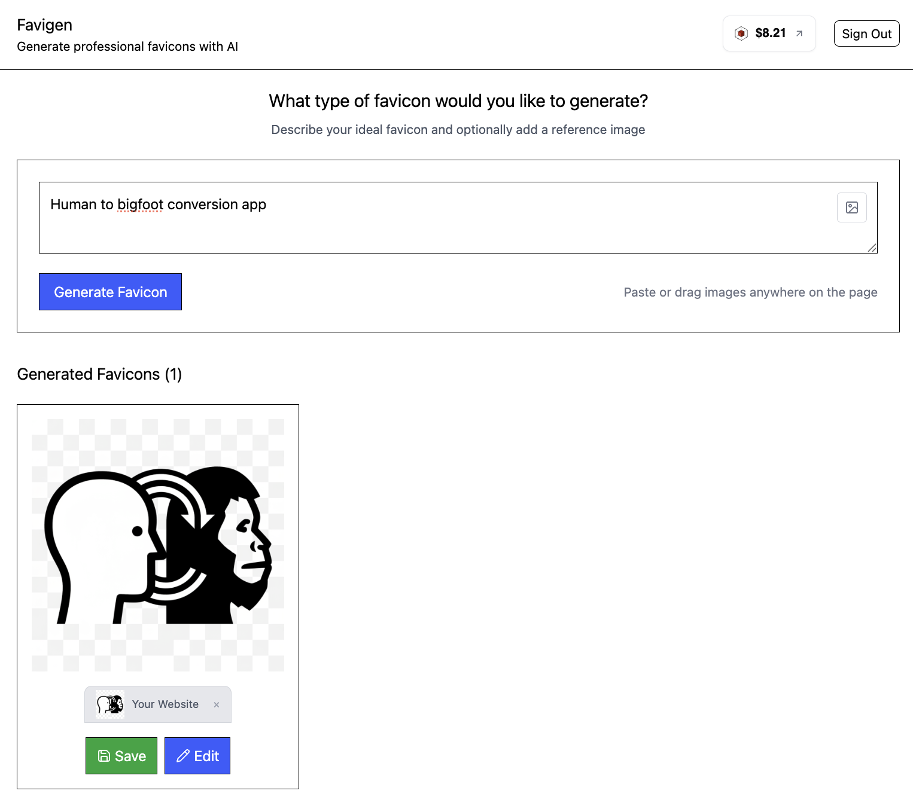

# Echo Nano Banana
Change 5 lines-of-code to create monetized Nano Banana apps. [Try it out live](https://echo-nano-banana.vercel.app/).




Fork and remix this to make a much more opinionated revenue-generating app in 15 minutes.


# Development
```bash
pnpm install
pnpm dev
```

To point revenue at your own app go to [echo.merit.systems](https://echo.merit.systems/), create a new app, and replace the `VITE_ECHO_APP_ID` in `.env`.
